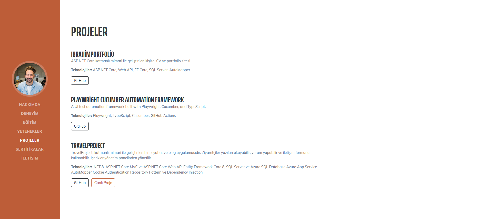
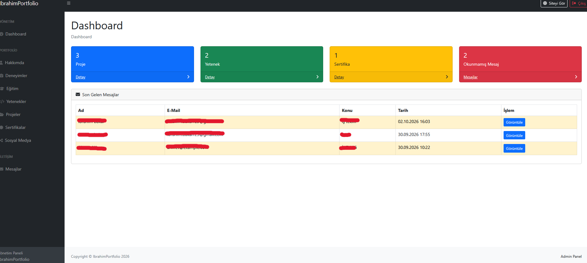

# IbrahimPortfolio

ASP.NET Core MVC ve Web API kullanılarak geliştirilmiş, dinamik içerik yönetimi ve yönetim paneline sahip kişisel portfolio uygulaması. .NET 8 tabanlı katmanlı mimaride public site ve admin paneli aynı API üzerinden çalışır.

## 📸 Ekran Görüntüleri

### 🌐 Portfolio

Public portfolio, API'den alınan verilerle dinamik olarak oluşturulur.

### Projeler



### 🛠️ Admin Panel

Admin paneli portfolio içeriklerini ve gelen mesajları yönetmek için kullanılır.

#### Dashboard



## 🚀 Özellikler

- **Public portfolio:** Hakkımda, deneyim, eğitim, yetenekler, projeler, sertifikalar, sıralı aktif sosyal medya hesapları, CV bağlantısı ve iletişim formu.
- **Admin:** Giriş/çıkış, rol tabanlı yetkilendirme, Hakkımda güncelleme ve diğer portfolio içerikleri için CRUD ekranları.
- **Dashboard ve mesajlar:** Paralel API çağrılarıyla sayaçlar, son beş mesaj, mesaj detayı, okundu/okunmadı durumu ve silme.
- **Backend:** REST API, altı katmanlı mimari, Generic Repository, Service/Manager, AutoMapper ve EF Core ile SQL Server erişimi.
- **Doğrulama ve güvenlik:** Cookie Authentication, CSRF koruması, User Secrets, yönetim API anahtarı, alan/tarih/URL doğrulaması.
- **Hata durumları:** Boş listeler, API kesintisi, başarısız işlemler ve 404 için kullanıcıya açıklayıcı mesajlar.

## 🛠️ Kullanılan Teknolojiler

.NET 8, ASP.NET Core MVC ve Web API, Entity Framework Core 8, SQL Server, AutoMapper, Generic Repository, Dependency Injection, Typed HttpClient, Cookie Authentication, Razor Views, ViewComponents ve Bootstrap. Public arayüz Start Bootstrap Resume, admin arayüz SB Admin üzerine kuruludur.

## 🏗️ Proje Mimarisi

| Proje | Sorumluluk |
| --- | --- |
| IbrahimPortfolio.Entity | About, Experience, Education, Skill, Project, Certificate, SocialMedia, Message entity'leri |
| IbrahimPortfolio.DataAccess | SQL Server, EF Core 8, AppDbContext, Generic Repository ve migration'lar |
| IbrahimPortfolio.Dto | İstek/yanıt DTO'ları, DataAnnotations ve URL/tarih doğrulaması |
| IbrahimPortfolio.Business | Service interface'leri, Manager sınıfları ve AutoMapper mapping'leri |
| IbrahimPortfolio.WebApi | CRUD endpointleri, doğrulama, hata yanıtları ve yönetim API anahtarı kontrolü |
| IbrahimPortfolio.WebUI | ASP.NET Core MVC, Admin Area, Cookie Authentication, ViewComponents ve typed HttpClient |

Veri akışı: WebUI → WebApi → Business → DataAccess → SQL Server. Entity ve DTO sınırları korunur.

## 🔐 Güvenlik

Admin controller'ları `[Authorize(Roles = "Admin")]` kullanan `AdminBaseController` üzerinden korunur. Login anonymous erişime açıktır. Cookie HttpOnly'dir, iki saat geçerlidir ve sliding expiration kullanır. Production'da Secure cookie ve HTTPS API adresi zorunludur. Logout POST ile cookie'yi siler; admin yanıtları cache edilmez.

WebUI POST işlemleri anti-forgery doğrulaması kullanır. Silme ve okundu işlemleri GET ile çalışmaz. DTO doğrulaması WebUI ve API'de uygulanır; opsiyonel alanlar nullable kalır. Bağlantılarda HTTP/HTTPS, görsel/CV alanlarında ayrıca `/` ile başlayan yerel yollar kabul edilir. Yeni sekme bağlantıları `noopener noreferrer` kullanır.

API'nin yazma işlemleri ve mesaj okuma endpointleri `X-Admin-Api-Key` ister. Anahtar yoksa erişim reddedilir. WebUI bu anahtarı yalnızca giriş yapmış adminin sunucu tarafındaki isteklerine ekler; tarayıcıya göndermez. Public portfolio GET istekleri ve iletişim formunun `POST /api/Message` endpointi anonymous kalır.

Production ayarlarını güvenli configuration/environment üzerinden sağlayın:

| Değişken | Uygulama |
| --- | --- |
| `AdminUser__Username`, `AdminUser__Password` | WebUI |
| `ApiSettings__BaseUrl` | WebUI, HTTPS API adresi |
| `ApiSettings__AdminApiKey` | WebUI ve WebApi, aynı değer |
| `ConnectionStrings__DefaultConnection` | WebApi |

## ⚙️ Kurulum

Gereksinimler: .NET 8 SDK, SQL Server/SQL Server Express ve EF Core 8 CLI aracı. Smoke testi için Windows ve PowerShell 7 kullanılır. Komutları solution kökünden çalıştırın.

1. Repository'yi klonlayın.

```powershell
git clone https://github.com/ibrahimbkrr/IbrahimPortfolio.git
cd IbrahimPortfolio
```

2. Bağımlılıkları geri yükleyip Release derlemesi alın.

```powershell
dotnet restore IbrahimPortfolio.sln --disable-parallel -m:1
dotnet build IbrahimPortfolio.sln --no-restore -c Release -m:1
```

Çalışan API/WebUI derleme dosyalarını kilitliyorsa ilgili geliştirme oturumunu durdurun veya `-c Release` ile ayrı çıktıda derleyin.

### 3. SQL Server bağlantısı

Makineye özel connection string repository'de tutulmaz. SQL Server instance adını kendi kurulumunuza göre değiştirip Development ayarını WebApi User Secrets'a kaydedin:

```powershell
dotnet user-secrets set "ConnectionStrings:DefaultConnection" "Server=.\SQLEXPRESS;Database=IbrahimPortfolioDb;Trusted_Connection=True;TrustServerCertificate=True;" --project IbrahimPortfolio.WebApi
```

Bu örnek Windows Authentication kullanır. SQL kullanıcı adı/parolası gereken ortamlarda gerçek bağlantıyı yalnızca User Secrets veya güvenli environment configuration ile sağlayın. `TrustServerCertificate=True` yerel geliştirme içindir; production TLS ayarlarını ortamınıza göre yapılandırın.

### 4. Admin hesabı ve API anahtarı

WebUI ve WebApi proje dosyalarında `UserSecretsId` tanımlıdır; `dotnet user-secrets init` çalıştırmanız gerekmez. Kullanıcı adı örnektir; parola ve anahtar placeholder'larını kendi güçlü değerlerinizle değiştirin.

```powershell
dotnet user-secrets set "AdminUser:Username" "admin" --project IbrahimPortfolio.WebUI
dotnet user-secrets set "AdminUser:Password" "YOUR_SECURE_PASSWORD" --project IbrahimPortfolio.WebUI

# Aynı uzun, rastgele anahtarı iki projeye de yazın; aşağıdakini gerçek anahtarınızla değiştirin.
dotnet user-secrets set "ApiSettings:AdminApiKey" "YOUR_RANDOM_SHARED_API_KEY" --project IbrahimPortfolio.WebUI
dotnet user-secrets set "ApiSettings:AdminApiKey" "YOUR_RANDOM_SHARED_API_KEY" --project IbrahimPortfolio.WebApi

```

Örnek parolaları/anahtarları kullanmayın. Gerçek değerleri source code veya appsettings dosyalarına yazmayın. User Secrets yalnızca Development içindir ve şifreli bir production secret store değildir. Önceki kaynak kodundaki parolayı kullandıysanız değiştirin.

## 🗄️ Veritabanı

Mevcut migration'lar `IbrahimPortfolio.DataAccess/Migrations` altındadır. Bu iyileştirmeler entity/DB şemasını değiştirmez; yeni migration gerekmez. İlk kurulumda veya mevcut migration'ları uygulamak için:

```powershell
# Yüklü değilse:
dotnet tool install --global dotnet-ef --version 8.0.16
$env:ASPNETCORE_ENVIRONMENT = "Development"
dotnet ef database update --project IbrahimPortfolio.DataAccess --startup-project IbrahimPortfolio.WebApi
```

Veritabanı adı `IbrahimPortfolioDb`'dir. Migration örnek portfolio kaydı eklemez. Boş kurulumda ilk Hakkımda kaydını `POST /api/About` ile, `X-Admin-Api-Key` başlığını kullanarak ekleyin; ardından admin panelinden güncelleyebilirsiniz. Diğer içerikler panelden eklenebilir.

## ▶️ Projeyi Çalıştırma

İki ayrı terminalde:

```powershell
dotnet run --project IbrahimPortfolio.WebApi --launch-profile http
dotnet run --project IbrahimPortfolio.WebUI --launch-profile http
```

- API: `http://localhost:5000`, Development Swagger: `/swagger`.
- WebUI: `http://localhost:5273`, admin giriş: `/Admin/Login`, dashboard: `/Admin/Dashboard`.
- Development API adresi WebUI `appsettings.Development.json` içindeki `ApiSettings:BaseUrl` üzerinden ayarlanır.
- HTTPS profilleri de mevcuttur; iki uygulamanın adreslerini uyumlu yapılandırın.

Bu adresler mevcut `Properties/launchSettings.json` dosyalarındaki `http` profillerine aittir. `https` profilleri WebApi için `https://localhost:7147`, WebUI için `https://localhost:7244` adreslerini de açar. Portları değiştirirseniz WebUI `ApiSettings:BaseUrl` değerini de yeni API adresine göre güncelleyin. Başlatma logundaki `Now listening on` adresi çalışmakta olan uygulamanın adresidir.

## API

`api/About`, `api/Experience`, `api/Education`, `api/Skill`, `api/Projects`, `api/Certificate`, `api/SocialMedia`: GET liste, GET `{id}`, POST oluşturma, PUT güncelleme, DELETE `{id}`. Güncelleme DTO'su ID içerir. Bulunamayan kayıtlar 404, geçersiz DTO'lar 400 döner.

`api/Message`: POST iletişim mesajı; korumalı GET liste/`{id}`, PUT `{id}/read`, DELETE `{id}`. Genel mesaj güncelleme endpointi kaldırılmıştır; okundu işlemi gönderen, içerik ve tarihi değiştiremez.

## Kontrol ve Testler

Yeni test paketi eklemeden çalışan kontroller:

```powershell
dotnet restore tests/IbrahimPortfolio.Checks --disable-parallel -m:1
dotnet build tests/IbrahimPortfolio.Checks --no-restore -c Release -m:1
dotnet tests/IbrahimPortfolio.Checks/bin/Release/net8.0/IbrahimPortfolio.Checks.dll
pwsh -File tests/Smoke.ps1
```

Kod kontrolleri mapping, CRUD manager'ları, DTO doğrulaması, API yetkileri ve hata yönetimini sınar. HTTP kontrolleri gerçek WebUI'ı ve gerçek API controller/manager'larını, ayrı bellek repository'leriyle çalıştırır; SQL verilerinizi değiştirmez. Testler 55180 ve 55181 portlarını kullanır, geçici test parolaları/anahtarları üretir ve bitince kendi süreçlerini durdurur. Loglar Git dışında tutulan `.artifacts` altındadır.

İsteğe bağlı gerçek SQL mesaj testi (eklenen test kaydı aynı transaction içinde silinir ve transaction geri alınır; mevcut kayıtlara dokunulmaz):

```powershell
$env:PORTFOLIO_TEST_SQL = "Server=.\SQLEXPRESS;Database=IbrahimPortfolioDb;Trusted_Connection=True;TrustServerCertificate=True;"
dotnet tests/IbrahimPortfolio.Checks/bin/Release/net8.0/IbrahimPortfolio.Checks.dll --check-sql
Remove-Item Env:PORTFOLIO_TEST_SQL
```

Giriş yapmadan admin URL'lerini, hatalı/doğru login'i, logout'u; tüm Create/Update/Delete formlarını; public sayfaya yansıyan içerikleri ve iletişim → okunmamış sayaç → görüntüle → okundu akışını kontrol edin. API'yi durdurduğunuzda sayfa açılmalı ve uyarı gösterilmelidir. Veritabanına bağlı uçtan uca sonuçlar için yerel SQL Server bağlantınız çalışır durumda olmalıdır.

## 📁 Proje Yapısı

```text
IbrahimPortfolio.sln
IbrahimPortfolio.Entity/
IbrahimPortfolio.DataAccess/
IbrahimPortfolio.Business/
IbrahimPortfolio.Dto/
IbrahimPortfolio.WebApi/
IbrahimPortfolio.WebUI/
tests/IbrahimPortfolio.Checks/
tests/Smoke.ps1
screenshots/
```

## 📌 Notlar

- Start Bootstrap Resume ve SB Admin tasarım dilleri korunur. WebUI typed HttpClient servisleriyle API'ye bağlanır; public bölümler ViewComponents ile oluşturulur.
- Admin değişiklikleri public sayfa yeniden açıldığında görünür. Mesajın oluşturulma tarihi sunucuda atanır ve yeni mesaj okunmamış olarak kaydedilir.
- Mesajın Görüntüle düğmesi CSRF korumalı POST ile okundu durumunu değiştirip detaya yönlendirir; doğrudan GET detay isteği veri değiştirmez. Dashboard'da alınamayan sayaçlar `—` olarak gösterilir.

Kaynak kod, proje dosyaları, migration'lar, test kaynakları ve gerekli `wwwroot` tema dosyaları repository'de bulunur. Derleme/test çıktıları, IDE önbellekleri, loglar, `.env` dosyaları, yerel configuration ve sertifika/private key dosyaları Git dışında tutulur. Tema ve üçüncü taraf kütüphanelerdeki mevcut lisans/copyright bildirimleri korunur.
